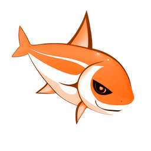
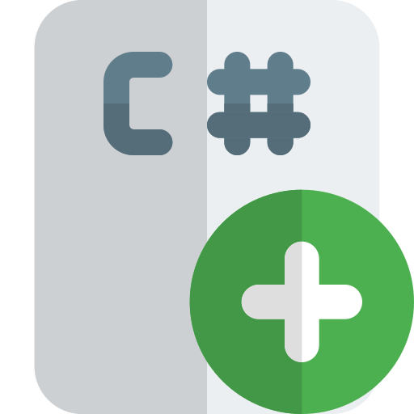

# Bugfish

My name is Bugfish, and I've been a software developer since 2005. I'm really proud to collaborate with great partners and would like to extend my appreciation to all my friends and colleagues who are working with me. Feel free to join my discord and check out my websites/profiles for news!

  

    
    

      <h3>Website</h3>
      
Website for my personal projects and much more.

    

  

  

    
    

      <h3>Suitefish</h3>
      
The official Suitefish-CMS website.

    

  

  

    
    

      <h3>Blogspot</h3>
      
At my Blog you can see some news.

    

  

   

    
    

      <h3>Discord</h3>
      
My Discord Server is open for everyone.

    

  

  

    
    

      <h3>Software</h3>
      
In my collection, you will find various types of software.

    

  

  

    
    

      <h3>Music</h3>
      
Here, you can find my free-to-use and commercial music pieces.

    

  

  

    
    

      <h3>Digital Art</h3>
      
Image and video content from my projects.

    

  

  

    
    

      <h3>Patreon</h3>
      
Support my projects on Patreon.

    

  

  

    
    

      <h3>Github</h3>
      
Software distribution page.

    

  
 

