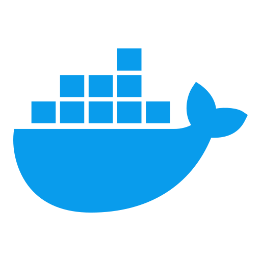

# Software

Below you'll find an overview of my software projects, along with a link to my GitHub profile where you can explore the code, contributions, and additional work in more detail.

  

    
    

      <h3>Back</h3>
    

  

 
  

    
    

      <h3>Github</h3>
    

  
 

  

    
    

      <h3>DockerHUB</h3>
    

  
 

  

    
    

      <h3>Suitefish CMS</h3>
      
This PHP CMS offers many features, simplifying setup, customization, and maintenance.

    

  

 
  

    
    

      <h3>Bugfish Framework</h3>
      
A robust framework integrating PHP, CSS, and JavaScript to streamline web application development.

    

  

  

    
    

      <h3>Dolibarr Framework</h3>
      
A Dolibarr module that integrates the Bugfish Framework, adding development tools and logging features.

    

  

  

    
    

      <h3>Bind9 Web Manager</h3>
      
A PHP-based DNS management tool with user administration and replication features.

    

  
 

  

    
    

      <h3>Online Book Renting</h3>
      
A web-based platform for managing book rentals, featuring user management, multi-language support, and ISBN handling.

    

  

  

    
    

      <h3>Mail Relaying over DNS</h3>
      
Transforms your server into a mail backup relay, storing and forwarding mail when the primary server is offline.

    

  

  

    
    

      <h3>Android Web App</h3>
      
An Android Studio project to create a simple web app with navigation controls, easily customizable for your website.

    

  

  

    
    

      <h3>Dovecot Certificate Interface</h3>
      
Automates Dovecot per-domain SSL certificate setup, managing ISPConfig configurations or working independently.

    

  

  

    
    

      <h3>Image Download Manager</h3>
      
Downloads images from a website, with options to explore subpages and filter high-definition images.

    

  

  

    
    

      <h3>Hash Cracker</h3>
      
A tool that recovers hashes using brute-force attacks, or decoding common hash types.

    

  

  

    
    

      <h3>Bugfish Nuke</h3>
      
Bugfish Nuke offers fast, configurable, and reliable data destruction.

    

  

  

    
    

      <h3>jQuery Sortselect</h3>
      
A jQuery plugin that enhances html 'select' elements with dual sortable select boxes for better UI control.

    

  

  

    
    

      <h3>Proxmox VMA2RAW</h3>
      
Converts Proxmox VMA backup files to raw disk images using a Docker image.

    

  

  

