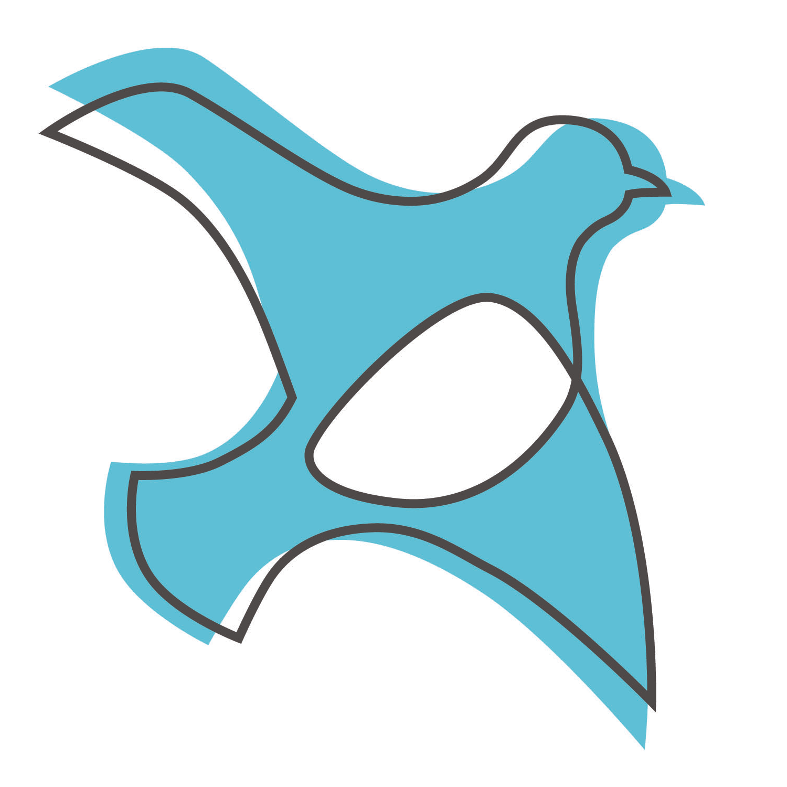

# Social

Below, you'll find links to my social media profiles where I share updates, creative work, and connect with my community. 

  

    
    

      <h3>Back</h3>
      
Go back to the start page.

    

  

  
  

    
    

      <h3>Facebook</h3>
      
Facebook page.

    

  

  
  

    
    

      <h3>Blogger</h3>
      
Blogger page.

    

  

  
  

    
    

      <h3>Instagram</h3>
      
Instagram page.

    

  

  
  

    
    

      <h3>X (Twitter)</h3>
      
Twitter(X) page.

    

  

  
  

    
    

      <h3>TikTok</h3>
      
View the TikTok Account.

    

  

  
  

    
    

      <h3>Patreon</h3>
      
Support my projects on patreon.

    

  

  

    
    

      <h3>Steam Group</h3>
      
View the Steam group.

    

  

  

    
    

      <h3>Discord</h3>
      
Invite to the Discord server.

    

  

  

    
    

      <h3>OpenPetition</h3>
      
Join my petitions!

    

  

  

