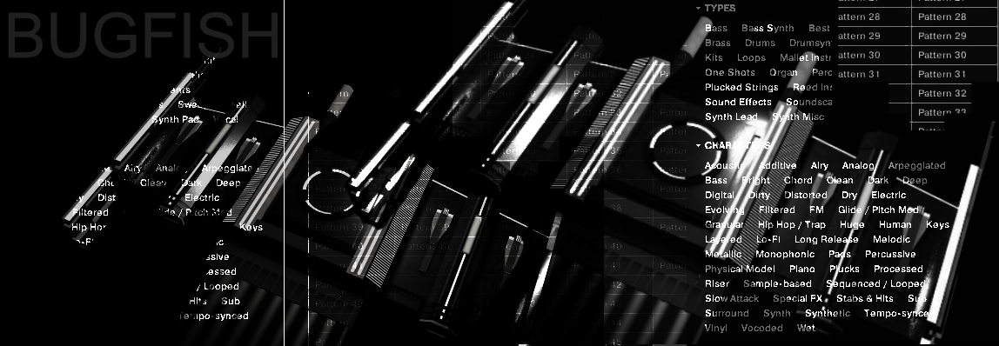
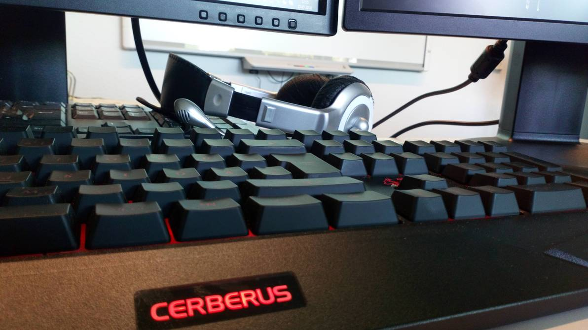
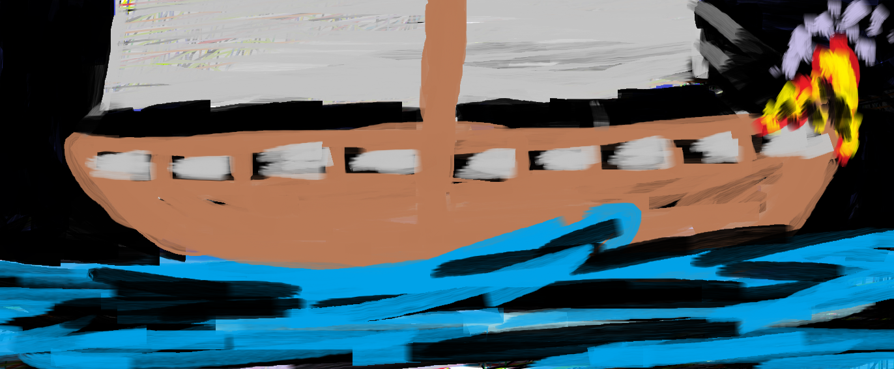

# About Me

## Introduction

My name is Jan-Maurice Dahlmanns, born 1994 and dedicated software developer and server administrator since 2008.

Here you can find some information about what I do! Feel free to take a look at my [YouTube Channel](https://youtube.com/bugfishtm), where I have also uploaded some video documentations and more. If you want to support me, please subscribe to my YouTube channel!

## Interesting URLs

 - [Bandcamp](https://bugfish.bandcamp.com)
 - [Soundcloud](https://soundcloud.com/bugfishtm)
 - [Pixabay](https://pixabay.com/de/users/bugfish-15886987/)
 - [Youtube](https://youtube.com/bugfishtm)
 - [Blog](https://bugfishtm.blogspot.com)
 - [Facebook](https://www.facebook.com/officialbugfish/)
 - [Spotify](https://open.spotify.com/artist/22t8XUzb2rVqKywyCaS36k)
 - [Steam](https://steamcommunity.com/id/bugfishtm)
 - [Deviantart](https://deviantart.com/bxgfxsh)
 - [Website](https://bugfish.eu)
 - [CMS Store](https://cms.bugfish.eu)
 - [Software Store](https://software.bugfish.eu)

## Videos

I am constantly improving my skills by creating 3D videos using the models I design.

## Music

In my free time, I enjoy creating music.

## Software

My open-source software projects are listed in the "Home" section of this website. There, you can find buttons to view different project documentations or download them directly from GitHub! These projects are also listed in the Projects section of my website.

## GFX
I mostly create images to use in my own projects! Here are a few examples. You can find more on my website: [here](https://bugfish.eu).

 

